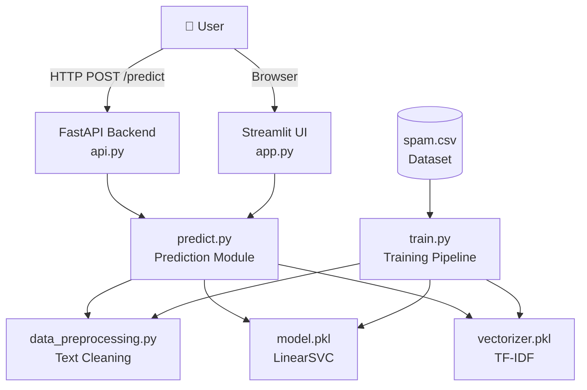
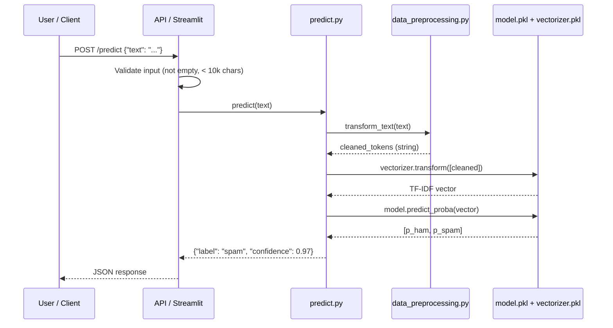
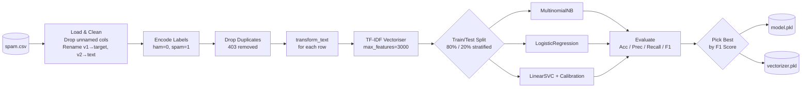
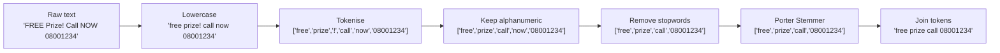

# 📧 Email / SMS Spam Detection System

> A **production-ready**, modular ML system that classifies email and SMS messages as **spam** or **ham** — complete with a REST API, interactive web UI, and a full test suite.

[](https://www.python.org/)
[](https://scikit-learn.org/)
[](https://fastapi.tiangolo.com/)
[](https://streamlit.io/)
[](#testing)

---

## Table of Contents

1. [Overview](#overview)
2. [Features](#features)
3. [System Architecture](#system-architecture)
4. [Project Structure](#project-structure)
5. [ML Pipeline](#ml-pipeline)
6. [API Reference](#api-reference)
7. [Getting Started](#getting-started)
8. [Configuration](#configuration)
9. [Running the Application](#running-the-application)
10. [Testing](#testing)
11. [Docker Deployment](#docker-deployment)
12. [Cloud Deployment](#cloud-deployment)
13. [Model Performance](#model-performance)
14. [Troubleshooting](#troubleshooting)
15. [Tech Stack](#tech-stack)

---

## Overview

This system is built on the **SMS Spam Collection Dataset** (5,169 messages after deduplication) and exposes spam classification through:

- A **Streamlit web app** for interactive use
- A **FastAPI REST service** for programmatic / backend integration
- A **clean Python module interface** for direct import in other codebases

The project is designed to be interview-ready — demonstrating modular architecture, proper ML practices (consistent preprocessing, model comparison, evaluation), REST API design, testing, and containerisation.

---

## Features

| Capability | Detail |
|---|---|
| 🧠 Model comparison | Trains Naive Bayes, Logistic Regression, and SVM; auto-picks best by F1 |
| 📊 Confidence scores | Every prediction includes a probability score (0–100 %) |
| 🔁 Consistent preprocessing | Identical text pipeline in training **and** inference — no leakage |
| 🌐 REST API | FastAPI with OpenAPI docs auto-generated at `/docs` |
| 🖥️ Web UI | Streamlit app with confidence bar and input validation |
| ✅ Test suite | 22 pytest tests covering preprocessing, prediction, and API |
| 🐳 Docker ready | Single `docker build` + `docker run` to deploy anywhere |
| 📖 Detailed logging | Timestamped logs at every stage of the pipeline |

---

## System Architecture

### High-Level Overview



### Data Flow — Prediction



### Training Pipeline



### Text Preprocessing Pipeline



---

## Project Structure

```
Email-Spam-Detector/
│
├── 📄 data_preprocessing.py   # Shared text preprocessing (used by train + predict)
├── 📄 train.py                # Full ML training pipeline
├── 📄 predict.py              # Inference module — model loaded once at startup
├── 📄 api.py                  # FastAPI REST service
├── 📄 app.py                  # Streamlit web application
│
├── 📊 spam.csv                # SMS Spam Collection dataset (5,572 messages)
│
├── 🤖 model.pkl               # Trained model (generated by train.py)
├── 🔢 vectorizer.pkl          # TF-IDF vectoriser (generated by train.py)
│
├── 🧪 tests/
│   ├── __init__.py
│   ├── test_preprocessing.py  # 8 tests — text cleaning edge cases
│   ├── test_predict.py        # 8 tests — prediction output, errors
│   └── test_api.py            # 6 tests — HTTP endpoints
│
├── 📦 requirements.txt        # Python dependencies with version ranges
├── 🐳 Dockerfile              # Container build definition
└── 📖 README.md
```

**Module dependency graph:**

```
spam.csv  ──►  train.py  ──►  model.pkl
                   │           vectorizer.pkl
                   ▼
        data_preprocessing.py
                   ▲
                   │
               predict.py  ◄──  api.py
                               app.py
```

---

## ML Pipeline

### Dataset

The [SMS Spam Collection Dataset](https://www.kaggle.com/datasets/uciml/sms-spam-collection-dataset) contains 5,572 messages (4,825 ham, 747 spam). After removing 403 duplicates, **5,169 messages** are used for training.

### Preprocessing (`data_preprocessing.py`)

Every text goes through the same 5-step pipeline — identical during training and inference:

| Step | Input | Output |
|---|---|---|
| 1. Lowercase | `"FREE Entry Win"` | `"free entry win"` |
| 2. Tokenise | `"free entry win"` | `["free","entry","win"]` |
| 3. Keep alphanumeric | `["free","entry","!","win"]` | `["free","entry","win"]` |
| 4. Remove stopwords | `["free","entry","in","win"]` | `["free","entry","win"]` |
| 5. Porter Stemmer | `["winning","wins"]` | `["win","win"]` |

### Model Selection

| Model | Accuracy | Precision | Recall | F1 | Selected |
|---|---|---|---|---|---|
| MultinomialNB | 0.974 | 0.982 | 0.809 | 0.887 | |
| LogisticRegression | 0.958 | 1.000 | 0.672 | 0.804 | |
| **LinearSVC (Calibrated)** | **0.980** | **0.958** | **0.878** | **0.916** | ✅ |

LinearSVC is wrapped in `CalibratedClassifierCV` so it supports `predict_proba()` (needed for confidence scores).

---

## API Reference

The FastAPI server auto-generates interactive docs at **`http://localhost:8000/docs`**.

### `GET /health`

Health check. Returns HTTP 200 when the service is running.

**Response:**
```json
{ "status": "ok" }
```

---

### `POST /predict`

Classify a text as spam or ham.

**Request body:**
```json
{ "text": "Congratulations! You've won a free vacation!" }
```

| Field | Type | Required | Constraints |
|---|---|---|---|
| `text` | string | ✅ | Non-empty, max 10,000 characters |

**Response (200 OK):**
```json
{
  "label": "spam",
  "confidence": 0.9741
}
```

| Field | Type | Description |
|---|---|---|
| `label` | `"spam"` \| `"ham"` | Predicted class |
| `confidence` | `float` (0–1) | Model probability for the predicted class |

**Error responses:**

| Status | Cause |
|---|---|
| 422 | Empty text or missing `text` field |
| 400 | Text too long (> 10,000 chars) |
| 500 | Internal server error |

**Example with curl:**
```bash
curl -X POST http://localhost:8000/predict \
  -H "Content-Type: application/json" \
  -d '{"text": "Win a free iPhone now! Click here."}'
```

---

## Getting Started

### Prerequisites

- **Python 3.11+**  
- **pip** (or pip3)

Check your Python version:
```bash
python3 --version
```

### 1. Clone / Enter the Project

```bash
cd Email-Spam-Detector
```

### 2. Create a Virtual Environment (Recommended)

```bash
python3 -m venv venv
source venv/bin/activate      # macOS / Linux
venv\Scripts\activate         # Windows
```

### 3. Install Dependencies

```bash
pip3 install -r requirements.txt
```

### 4. Download NLTK Data

> **macOS users** — if you hit an SSL error, run the certificate fix command first:
> ```bash
> /Applications/Python\ 3.x/Install\ Certificates.command
> ```

```bash
python3 -c "import nltk; nltk.download('punkt'); nltk.download('punkt_tab'); nltk.download('stopwords')"
```

### 5. Train the Model

```bash
python3 train.py
```

You should see model comparison metrics printed and:
```
✅  Training complete. Best model: LinearSVC
    Model saved to  : .../model.pkl
    Vectorizer saved: .../vectorizer.pkl
```

---

## Configuration

| Setting | Location | Default | Description |
|---|---|---|---|
| `MAX_INPUT_LENGTH` | `predict.py` | 10,000 chars | Max text length for inference |
| TF-IDF features | `train.py` | 3,000 | Vocabulary size |
| Train/test split | `train.py` | 80/20, stratified | Data split |
| Model selection metric | `train.py` | F1 score | Criterion for best model |

---

## Running the Application

### Option A — Streamlit Web UI

```bash
streamlit run app.py
```

Open **[http://localhost:8501](http://localhost:8501)** in your browser.

The UI features:
- A text input area to paste any email or SMS
- A **Predict** button
- A colour-coded result banner (🚨 Spam / ✅ Ham)
- A **confidence percentage + progress bar**
- Input validation and error messages

### Option B — FastAPI Backend

```bash
uvicorn api:app --host 0.0.0.0 --port 8000
```

- API: [http://localhost:8000/predict](http://localhost:8000/predict)
- Interactive docs: [http://localhost:8000/docs](http://localhost:8000/docs)

### Option C — Python Module

```python
from predict import predict

result = predict("You have won a free prize! Call now.")
print(result)
# {"label": "spam", "confidence": 0.97}
```

---

## Testing

```bash
python3 -m pytest tests/ -v
```

**Expected output: 22 passed ✅**

| Test file | Tests | What it covers |
|---|---|---|
| `test_preprocessing.py` | 8 | Empty strings, special chars, stopword removal, stemming, long text, non-string input |
| `test_predict.py` | 8 | Output format, spam/ham detection, confidence range, error handling |
| `test_api.py` | 6 | Health endpoint, valid prediction, empty/missing input, wrong HTTP method |

---

## Docker Deployment

### Build

```bash
docker build -t spam-detector .
```

### Run the API

```bash
docker run -p 8000:8000 spam-detector
```

### Run the Streamlit UI

```bash
docker run -p 8501:8501 spam-detector \
  streamlit run app.py --server.port 8501 --server.address 0.0.0.0
```

> **Note:** The Dockerfile downloads NLTK data at build time, so no internet connection is needed at runtime.

---

## Cloud Deployment

### Render

1. Push the project to a GitHub repository.
2. Create a **New Web Service** on [Render](https://render.com) and connect the repo.
3. Set:
   - **Build Command:**
     ```
     pip install -r requirements.txt && python -c "import nltk; nltk.download('punkt'); nltk.download('punkt_tab'); nltk.download('stopwords')" && python train.py
     ```
   - **Start Command:**
     ```
     uvicorn api:app --host 0.0.0.0 --port $PORT
     ```
4. Click **Deploy**.

### AWS EC2

```bash
# 1. Launch Ubuntu EC2 instance, SSH in
# 2. Install Python
sudo apt update && sudo apt install -y python3 python3-pip python3-venv

# 3. Clone / upload your project
git clone <your-repo-url>
cd Email-Spam-Detector

# 4. Set up environment
python3 -m venv venv && source venv/bin/activate
pip install -r requirements.txt

# 5. Download NLTK data and train
python -c "import nltk; nltk.download('punkt'); nltk.download('punkt_tab'); nltk.download('stopwords')"
python train.py

# 6. Run API (use screen or systemd to keep it alive)
uvicorn api:app --host 0.0.0.0 --port 8000
```

Open port **8000** in your EC2 Security Group to allow inbound traffic.

---

## Model Performance

### Confusion Matrix Interpretation

```
              Predicted Ham   Predicted Spam
Actual Ham        TN = 894        FP = 9
Actual Spam       FN = 16        TP = 115
```

*(Based on LinearSVC on the 20% held-out test set — 1,034 messages)*

| Metric | Ham | Spam |
|---|---|---|
| Precision | 0.98 | 0.95 |
| Recall | 0.99 | 0.88 |
| F1 | 0.99 | **0.92** |
| Support | 903 | 131 |

**Overall accuracy: 98%**

---

## Troubleshooting

### SSL Error when downloading NLTK data (macOS)
```bash
/Applications/Python\ 3.x/Install\ Certificates.command
```
Or use the Python workaround:
```python
import ssl; ssl._create_default_https_context = ssl._create_unverified_context
import nltk; nltk.download('punkt')
```

### `FileNotFoundError: model.pkl not found`
The model has not been trained yet. Run:
```bash
python3 train.py
```

### Streamlit app shows `ModuleNotFoundError`
Make sure you're running from the project root directory:
```bash
cd Email-Spam-Detector
streamlit run app.py
```

### Port already in use
Change the port:
```bash
uvicorn api:app --port 8001
# or
streamlit run app.py --server.port 8502
```

---

## Tech Stack

| Layer | Technology | Version |
|---|---|---|
| Language | Python | 3.11+ |
| ML Framework | scikit-learn | 1.3+ |
| NLP | NLTK | 3.8+ |
| Data | pandas, numpy | 2.0+, 1.24+ |
| Web UI | Streamlit | 1.30+ |
| REST API | FastAPI + Uvicorn | 0.110+ |
| Data Validation | Pydantic v2 | 2.0+ |
| HTTP Client (tests) | httpx | 0.27+ |
| Testing | pytest | 8.0+ |
| Containerisation | Docker | any recent |

---

## Dataset Credit

[SMS Spam Collection Dataset](https://archive.ics.uci.edu/ml/datasets/SMS+Spam+Collection) — UCI Machine Learning Repository.  
Almeida, T.A., Gómez Hidalgo, J.M., Yamakami, A. Contributions to the Study of SMS Spam Filtering: New Collection and Results. 2011.
